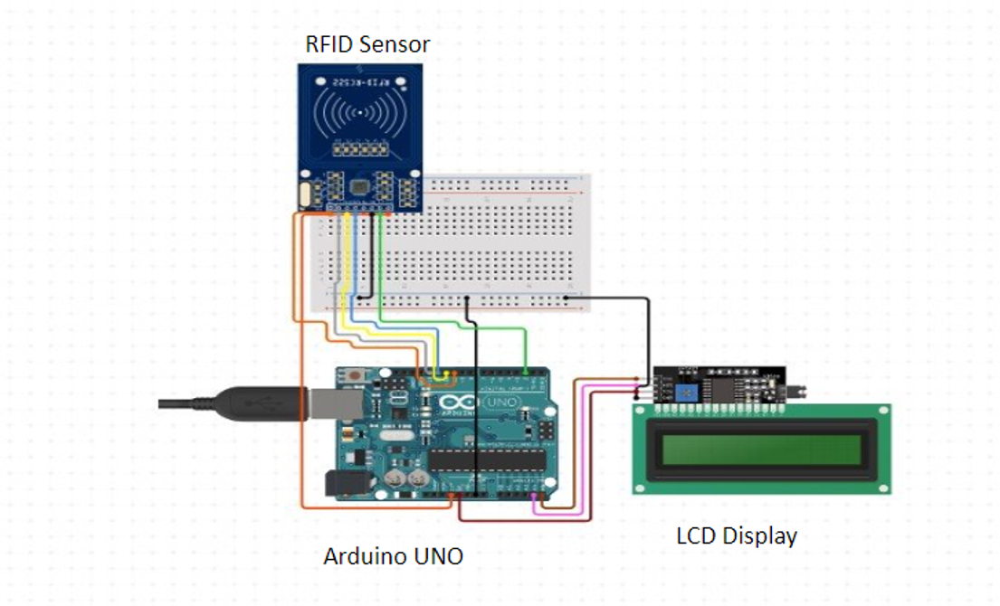

# Livestock Monitoring System 🐄🐏

This project is an **RFID-based Livestock Monitoring System** using **Arduino**. It detects animals entering or exiting using RFID tags and displays the status on an LCD screen.

## 📦 Required Hardware

- Arduino Uno
- MFRC522 RFID Module
- Servo Motor
- LiquidCrystal\_I2C Display
- Buzzer
- Jumper Wires

## 🔧 Required Libraries

You need to install the following libraries in **Arduino IDE**:

1. **MFRC522 Library** (for RFID module)\

   **Installation:**

   - Open **Arduino IDE**
   - Go to **Sketch** → **Include Library** → **Manage Libraries**
   - Search for **MFRC522** and install it

2. **LiquidCrystal\_I2C Library** (for LCD display)\
   🔗 [Download Here](https://github.com/johnrickman/LiquidCrystal_I2C)

3. **Pre-installed Libraries** (No need to install separately)

   - **Wire.h** (I2C communication)
   - **SPI.h** (SPI communication)
   - **Servo.h** (Servo motor control)

## 🚀 How to Run the Project

1. **Install the Required Libraries** (as mentioned above)
2. **Upload the Code** to Arduino using **Arduino IDE**
3. **Connect the Hardware** according to the circuit diagram
4. **Power On** the system and scan RFID tags

## 📷 Circuit Diagram

## 🎯 Conclusion  

The **RFID-based Livestock Monitoring System** provides an efficient way to track and manage livestock using RFID technology. By automating the identification process, this system enhances accuracy, reduces manual effort, and improves farm management. Future improvements could include integrating a cloud-based database for real-time tracking and adding GSM modules for remote alerts.  

If you have any suggestions or improvements, feel free to contribute! 🚀  

